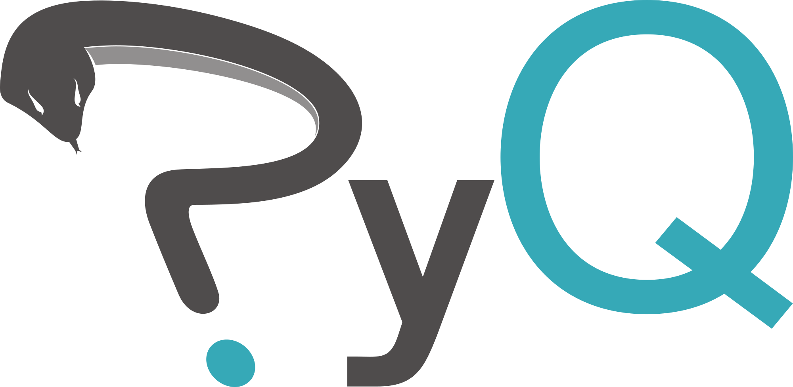
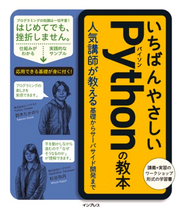
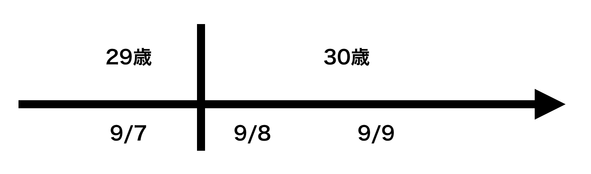
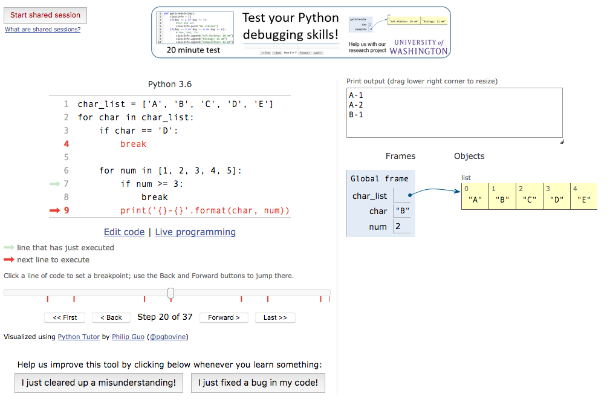

================================================
はじめてのPython学習の頑張りどころ
================================================

.. contents:: アジェンダ
   :depth: 3

発表について
----------------------------
この発表の目的
+++++++++++++++++++++
プログラムの学習を始めたのに第一段階で挫折しないための提案

この発表の背景
+++++++++++++++++++++
`PyQ <https://pyq.jp>`_ というオンラインPython学習サービスの問題開発とサポートに従事しています。
リリースまでの間、プログラム未経験の方々に問題を解いてもらい、沢山のフィードバックをいただきました。
その時に詰まってしまった箇所と、どのように説明したらわかっていただけたかを紹介します。

対象
+++++++++++++++++++++

- プログラミングをこれから学ぶ人
- プログラミング初心者に教えたい人

注意事項
+++++++++++++++++++++
一部のオススメ方法はモニターさん、実際の顧客への指導中に考えた私個人の考えです。
すべての人に当てはまる学習法はないと考えています。ただ、毎日、どのように説明したら伝わるか、すんなり理解できるかを考え続けています。

お前誰よ?
--------------

**大村 亀子（Kameko Ohmura）**

- 株式会社ビープラウド所属
- 主にPyQのコンテンツ開発を担当

  - PyQは2017年4月にリリース
  - これからも機能追加、問題追加、問題の改善を行っていきます。

- 各企業の新人研修、成人教育に10年以上従事

|

前提
--------------
パソコンを利用できる環境にある

プログラムできる環境を整えよう
------------------------------------------

Pythonのプログラミングができる環境
+++++++++++++++++++++++++++++++++++++++++

素直に自分のパソコンにプログラミングできる環境を作ることがオススメ。
書籍などを見て頑張って作りましょう。

あまり詳しくない場合、環境設定に1日ほどかかることがあります。
しかし、いつかは環境設定を必ずしなければならないので、大切なことを先にやるのは悪いことではないと思います。

すぐに始めたい場合は、 `codepad <http://codepad.org/>`_ などのブラウザでプログラムを実行できる環境を利用するのも一案です。

はじめの一歩 - 写経
------------------------------------------

環境ができたらプログラミングします。

プログラムをまったく書いたことがない
+++++++++++++++++++++++++++++++++++++++++++++++++++++++

**真似して書く**

小学生の時、漢字を書くために何回もノートに写しましたよね？

プログラミングも同じです。

しばらくはこの繰り返しです。

- プログラムを写す
- 動かす
- 1行ずつ確認する

.. code-block:: python

   print("Hello, World")

『Hello, World』と画面に表示される。

.. code-block:: python

   num = 10
   print(num)

変数numに10という値が代入されて、その値が画面に『10』と表示される。

困ったこと
++++++++++++++

正しく写すのが難しい。

慣れないプログラミングコードを写すのは大変です。

.. code-block:: python

   print("Hello, World"

閉じる『)』カッコが足りない。

.. code-block:: python

   print("Hello, World)

文字列を閉じる方の『"』ダブルクォーテーションが足りない。

間違っている箇所がわからない
^^^^^^^^^^^^^^^^^^^^^^^^^^^^^^^^^^^^^^^^^^^^^^^^^^^^^^^
どうする？

エラーを見ましょう
^^^^^^^^^^^^^^^^^^^^^^^^^^^^^^^^^^^^^^^^^^^^^^^^^^^^^^^

::

    $ python sample1.py
      File "sample1.py", line 1
        print("Hello, World)
                           ^
    SyntaxError: EOL while scanning string literal

最初の頃は書き間違いで発生している場合がほとんど。

SyntaxError: 構文エラー

書き間違ったらでる。

**EOL** って？

検索しよう『Python EOL』

End of lineの略。ファイルの最後まで文字列でした。
→　文字列が閉じられていない

**ある程度のエラーは覚えよう**

わからない場合は、エラー行（この場合は『SyntaxError: EOL while scanning string literal』）をそのまま検索する。何か引っかかる。

だいたいが英語のサイトです。プログラミングをやっていく上で **英語を読む** のは避けては通れない。頑張って読もう。

どうしてもわからない場合
^^^^^^^^^^^^^^^^^^^^^^^^^^^^^^^^^^^^^^^^^^^^^^^^^^^^^^^
`stack overflow <https://ja.stackoverflow.com/>`_ 、`teratail <https://teratail.com/>`_ などで聞く

あまり悩んでも時間の無駄です。

どうやったら正しく書けるようになる？
+++++++++++++++++++++++++++++++++++++++++

**沢山のプログラムを書く**

と、次第に慣れます。

ここまでのまとめ
+++++++++++++++++++++++++++++++++++++++++

- 最初は写して、動きを確認しよう
- エラーを確認しよう
- 困ったら、質問しよう

プログラミング教育の方針
-------------------------

- 初めて書く文法は解説する
- 公式ドキュメントなどを読んでもらい、不明点を質問してもらう（これで、公式ドキュメントに慣れていきます）
- なるべく本人にわからない箇所を詳細に解説してもらう（解説しているうちに解決することがある）
- 書き間違いは普通なので、悪い箇所、修正すべき箇所を教えない

  - ヒントを出す

    - 誕生日は当日は年齢が1歳上がっています。
    - この変数にはいっている値は何だとおもますか？

よくある質問
------------------
ここからはよくあるつまるところとその解説方法を紹介します。

比較の条件
+++++++++++++++++++++++++++++++++++++++++
比較の解説は図を書きましょう。

今年の年齢を求める

.. code-block:: python

    from datetime import date
    birthday = date(1987, 9, 8)
    today = date.today())
    this_year_birthday = date(today.year, birthday.month, birthday.day)

    if this_year_birthday > today:
        age = today.year - birthday.year
    else:
        age = today.year - birthday.year - 1

    print(age)

どこが違うのか？

- today = date(2017, 9, 8)に置き換えて試してもらう

さらによくわらないない場合は、

- 誕生日の考え方を図を描く

誕生日が1987年9月8日の場合:

気がつく。

『比較演算子が> じゃなくて、>=ですよ』と言ってもその場は解決するが、同じような間違いを繰り返す。

ループ
+++++++++++++++++++++++++++++++++++++++++

.. code-block:: python

    char_list = ['A', 'B', 'C', 'D', 'E']
    for char in char_list:
        if char == 'D':
            break

        for num in [1, 2, 3, 4, 5]:
            if num >= 3:
                break
            print('{}-{}'.format(char, num))

結果

::

    A-1
    A-2
    B-1
    B-2
    C-1
    C-2

繰り返しのイメージがつかない

1回ずつ何をしているかを考える

次第に慣れてくる

::

    2つのfor文が入れ子（ネストと表現します）になっている実装です。

    1つ目のfor文が外側、2つ目のfor文が内側になります。
    breakがfor文の中に書いてある場合、1つのfor文のみを抜けるという意味になります。

    詳細に見てみますと

    外側のfor文1周目：char='A'
      内側のfor文1周目：num=1
      print文実行:A-1
     内側のfor文2周目：num=2
     print文実行:A-2
     内側のfor文3周目：num=3
     if num >= 3:が成り立つので、breakが実行される
    　内側のfor文は途中だけど終了
    外側のfor文2周目：char='B'
     内側のfor文1周目：num=1
      print文実行:B-1
     （外側1週目と同じように続きます）
    外側のfor文3周目：char='C'
     内側のfor文1周目：num=1
      print文実行:C-1
     （外側1週目と同じように続きます）
    外側のfor文4周目：char='D'
     if char == 'D':が成り立つので、breakが実行される
    外側のfor文が終了。
    全体が終了

    このようにfor文が入れ子になっている場合にbreakが内側のfor文で実行されると
    内側のfor文の実行だけが終了する

1行ずつの変数の動きを解説するとわかってもらえる。面倒でも何度かやると次第に慣れてきます。

`Python Tutor <http://www.pythontutor.com/>`_ などを使うとさらにわかりやすい

集計しよう
+++++++++++++++++++++++++++++++++++++++++

集計もよく質問が来る。空の辞書の要素が増えていく、値が増加していくという処理がわかりづらい。

.. code-block:: python

    sample = ['x', 'y', 'z', 'x', 'x', 'y', 'x', 'y', 'x', 'z', 'k', 'm']
    count = {}

    # ここから下に書き写してください。
    for val in sample:
        if val in count.keys():
            count[val] += 1
        else:
            count[val] = 1

    # 表示
    for k, v in count.items():
        print(k + ':' + str(v))

回答

::

    この処理では for 文を使って、sampleリスト内の値を1つずつ val 変数に取り出しています。
    val 変数はループの回数に応じて以下のように変わります

    ループ1回目 val == 'x'
    ループ2回目 val == 'y'
    ループ3回目 val == 'z'
    ループ4回目 val == 'x'
    ループ5回目 val == 'x'
    ...

    次にこの val 変数を使って、 count辞書の値を更新しています。
    まず、　count.keys()　は辞書のキーの一覧をリストで取り出しますので、
    ループ1回目は辞書countは空なので、count.keys()の結果も空のリスト[]になります。

     if val in count.keys():

    count.keys()の結果は空のリストなので、
    このif文「count.keys()の中にval('x')は含まれているか？」はFalseとなります。

    そこで辞書にキーxがないので、キーxと値を追加しています。

    count[val] = 1

    この処理は、キーx追加する処理と、1つ目のxがあったのでxの値を+1する処理の2つの働きをしています。
    ここが5問目と違い、{'x': 0}が用意されていないので、キーの追加と+1を同時に行っています。

    この処理が実行された時点の辞書countは{'x': 1}という状態です。

    ループ2回目以降もあわせて見てみましょう。

    ループ1回目 val == 'x'  , count == {'x': 1}
    ループ2回目 val == 'y'  , count == {'x': 1, 'y': 1}
    ループ3回目 val == 'z'  , count == {'x': 1, 'y': 1, 'z': 1}
    ループ4回目 val == 'x'  , count == {'x': 2, 'y': 1, 'z': 1}
    ループ5回目 val == 'x'  , count == {'x': 3, 'y': 1, 'z': 1}
    ...

    4週目に2度めのxがでてきているので、キーが既に辞書countに存在するので、
    xの値を+1する処理のみを行います。

    count[val] += 1

    最後の表示部分は、その上の集計が終わった状態ですので
    辞書count の内部は{'x': 5, 'y': 3, 'z': 2, 'k': 1, 'm': 1}となっています。
    「 .items() を使ってループするときは
    for k, v in count.items(): とすると、k にキーを、vに値を取れます」
    ということですが、細かく見ていきましょう。

    辞書.items() を使うと以下のような値が返ります。

    [("x", 5), ("y", 3), ("z", 2), ("k", 1), ("m", 1)]

    これを以下のようにループしています。

    for k, v in [("x", 5), ("y", 3), ("z", 2), ("k", 1), ("m", 1)]:
        print(k + ':' + str(v))

    ループ1回目 k == "x", v == 5
    ループ2回目 k == "y", v == 3
    ループ3回目 k == "z", v == 2
    ループ4回目 k == "k", v == 1
    ループ5回目 k == "m", v == 1

    このように「2つずつの値のリスト」をfor文に渡すと
    for k, v in のようにそれぞれ値を分けて取得できます。
    これはPythonのfor文の機能です。

    print文も print("x" + ':' + str(5)) のようになりますので、
    変数の値（count辞書の中身の値）を出力してくれます。

ここまで解説するとわかってもらえる。
対面の場合は、質問者自身に1回ずつの処理を解説させる。

その他によく困っているところ
+++++++++++++++++++++++++++++++++++++++++

- 関数
- タプル

文法を覚えたその後は
----------------------

覚えたことを応用する
+++++++++++++++++++++++++++++++++++++++++

超えないといけない壁。

何か現在の知識で作れるものを探す。
お題を出すと作れる。

- タイムカード集計プログラム
- 文書の中に何度その文字列があるか数える
- 銀行通帳の科目別の集計

何回も使わないと身につかない。
プログラムは文法を覚えるのが大事ではなく、
完成品をどうやって作るかのすべての工程がイメージできるかが重要。
そのために使える知識が多いほうが有利。

レビューしてもらう
+++++++++++++++++++++++++++++++++++++++++

自分より知識がありそうな人に見てもらえると、知らない知識が増える。

やはり、スタート地点が同じでも作りたいものがはっきりしている方の上達は早い。

良いコードを読む
+++++++++++++++++++++++++++++++++++++++++

美しいコードを読みましょう。

仕事で美しいコードが読めればいいですが、

- 書籍
- OSS
- Python自体のコード（Github）
- Python製のライブラリのコード

上記の中には良い悪いはあります。
自分ならどう書くかを常にイメージするのが大事です。

公式ドキュメントを読んで欲しい
+++++++++++++++++++++++++++++++++++++++++

公式ドキュメント難しい
ブログ、読みやすい

でも、嘘があることが多い。初心者のうちは嘘が見分けられない。
teratailなどを利用する。

知らない文言がいっぱいある
+++++++++++++++++++++++++++++++++++++++++

- 検索する
- 本を読む
- 誰かに聞く（コミュニティが手っ取り早い）入れない時は有料サービス

ある程度の時間を差し出して、どっぷり勉強するのは大事です。

また、自分のコードを1日2日寝かしたあとに自分でレビューしてみるのも良い学びになります。

認定試験を受けてみるのも自分の弱い箇所がわかるのでオススメです。

最後に
--------
**集中して短期間に文法覚えるゾーンを抜ける。**

**初心者ゾーンは早めに抜けて、作りたいものを作って、世の中に貢献していきましょう！**
