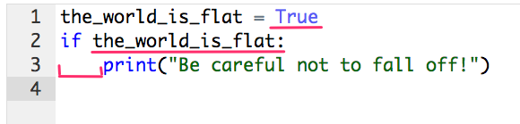

.. JavaJo201805 documentation master file, created by
   sphinx-quickstart on Sat May 12 22:46:52 2018.
   You can adapt this file completely to your liking, but it should at least
   contain the root `toctree` directive.

========================================
広がるPython（Python Big Bang）
========================================

| Kameko Ohmura
| https://github.com/okusama27

OverView
==============
* Pythonの歴史
* Pythonの思想
* Pythonの特徴
* Pythonの言語仕様の決め方

お前誰よ（Who am I?）
============================

.. image:: _static/images/cow.png
   :width: 50px

大村亀子といいます。 `@okusama27 <https://twitter.com/okusama27>`_

BeProudという会社で、Pythonオンライン学習サービスを作っています。

I'm Kameko Ohmura, please call me "kame-chan".

I'm working at `BeProud, inc. <https://www.beproud.jp/>`_

I'm developing Python web-learning service

.. image:: _static/images/logo_beproud.png
   :width: 200px

PyLadies Tokyo
============================
世界中にある女性のPython利用者をつなぐ団体。

スタッフやっています。

タイトル「広がるPython」
====================================

`PyCon JP 2018 <https://www.pycon.jp/#pycon-jp-2018>`_ のテーマをお借りしました。

PyCon JP は日本で開催される、プログラミング言語 Python に関する国際カンファレンスです。
毎年１０００人規模で行われています。

今年は、2018/9/15 〜 9/18の間で開催されます。

歴史
=======

はじまり
==============

1989年
---------------

オランダ人の `Guido van Rossum <https://en.wikipedia.org/wiki/Guido_van_Rossum>`_ がクリスマス休暇中に暇だったので開発を開始したのがはじまり。

イギリスで大人気だったテレビ番組「空飛ぶモンティ・パイソン」（Monty Python's Flying Circus）から取って、Pythonと名付けた。

.. image:: _static/images/python-logo-master-v3-TM.png
   :width: 300px

.. パイソンとは「ニシキヘビ」のことなので、Python関連のライブラリやアプリケーション、コミュニティーのシンボルるに蛇にちなんだアイコンが使われます。

2001年
-------------

Pythonソフトウェア財団、PSF（ `PythonSoftwareFoundation <https://www.python.org/psf/>`_ ）が組織される。

Python関連の知的所有権を所有するために作られた非営利団体。
Pythonのリリースはすべて `オープンソース <https://ja.wikipedia.org/wiki/%E3%82%AA%E3%83%BC%E3%83%97%E3%83%B3%E3%82%BD%E3%83%BC%E3%82%B9%E3%81%AE%E5%AE%9A%E7%BE%A9>`_ です。

.. Pythonは1990年代初頭に、オランダのStichtingMathematischCentrum(CWI。http://www.cwi.nl/参照)にいたGuidovanRossumにより、
   ABCという言語の後継として創造された。
   現在Pythonには他者からのコントリビューションが数多く含まれるが、第一著者は依然としてGuidoである。
   Guidoは1995年からヴァージニア州レストンにあるCorporationforNationalResearchInitiatives(CNRI。http://www.cnri.reston.va.us/参照)でPythonの作業を続け、ここでいくつかのバージョンをリリースした。
   2000年、GuidoとPythonコア開発チームはBeOpen.comに移り、BeOpenPythonLabsチームを結成した。
   同年10月、PythonLabsチームはDigitalCreation(現在はZopeCorporation。http://www.zope.com/参照)に移った。
   2001年、PythonSoftwareFoundation(PSF。https://www.python.org/psf/参照)が組織される。
   これはPython関連の知的所有権を所有するために作られたNPO団体である。ZopeCorporationはPSFの後援会員である。
   PythonのリリースはすべてOpenSourceである(大文字に注意。オープンソースの定義についてはhttp://opensource.org/参照)。
   歴史的には、ほとんどのPythonリリースはGPLコンパチブルだが、すべてがそうではない。
   「GPLコンパチブル」とは、我々がPythonをGPLで配布するという意味ではない。Pythonは全ライセンスにおいて、
   改変部分をオープンソースとしない改変版の配布を認めているが、これはGPLとは異なる。
   GPLコンパチブルなライセンスとは、PythonをGPLでリリースされたソフトウェアと組み合わせることを可能にするものである。
   コンパチブルでないライセンスでは不可能ということだ。
   Guidoの指揮のもと作業を行い、これらのリリースを可能にしてくれた数多くの外部ボランティアに感謝する。

バージョン
===============
1991年: バージョン 0.9x
-----------------------------

Guidoさんが、ソースコードを公開

1994年: バージョン 1.x
-----------------------------

2000年: バージョン 2.x
-----------------------------

サポートは2020年までと発表されている。（ `PEP404 <https://www.python.org/dev/peps/pep-0404/>`_ ）

2008年: バージョン 3.x
-----------------------------

言語を掃除してリフレッシュすることが目的としてリリースされた。

Python2.xとの後方互換が失われていることでPython2系から気軽にPython3系に移行できない問題がある。

.. Python3 系列は従来の Python1.x/2.x にあったいろいろな問題点を解決し、より優れた Python として生まれ変わりました。
   文字列の全面的な Unicode 化や、冗長な文法要素の改善、標準ライブラリの再構成など、多くの改善が加えられています。

.. RedHat Enterprise Linuxでは、Python2.7を2024年までサポートすることが決まっている。

Pythonは母体となる企業、営利団体もなしに長期間に渡って開発を継続し、安定したリリースを続けています。

思想
=====

キャッチフレーズ
==========================

1990年台に使われていたPythonのキャッチフレーズ

**Python gets the job done**

「Pythonは仕事を終らせる」という意味。

現実に処理しなければいけない仕事を片付けるために用意された実用品。
Pythonは華やかさよりも、シンプルな機能美を信条としています。

The Zen of Python
==========================

対話型インタプリタに ``import this`` と打つと、Pythonの哲学が表示される。

The Zen of Python, by Tim Peters（抜粋）
-------------------------------------------

* 醜いより美しい方がいい。
* 暗黙より明示の方がいい。
* 複雑より単純の方がいい。
* 読みやすさは大切だ。
* 実用性は純粋性に勝る。
* 仕事をするための当然の方法はひとつある。

（略）

私も翻訳してみました。 `The Zen of Python <http://kamekokamekame.net/python/2017/12/01/article.html>`_

特徴
=============

分類
================

* 手続き型言語
* オブジェクト指向プログラミング
* 動的型システム
* インタープリタ
* オープンソース

.. Python は動的型システムを持つインタープリタで、コンソールを使った対話的な操作もできることから、
   システム管理などの、一度限りの書き捨て処理を行うスクリプト言語としても使われます。
   しかし、本格的な汎用プログラミング言語としても、大規模なウェブアプリケーションや、
   企業の業務アプリケーションなどの開発言語として、広く利用されています。
   Python はなぜ今のような、人気の高いプログラミング言語になったのでしょうか。
   その理由と して、以下の様な理由があげられます。

読みやすい
================

* 見ただけで意味が理解できるように、普通のアルファベットの英単語で書ける様になっている。
* 見ただけで意味がわからない記号はなるべく使わない
* インデントを正しく付けないと動かないので、誰が書いても同じようなコードになり読みやすいです。

* Python利用者が全体で守るコーディング規約 `PEP8 <http://pep8-ja.readthedocs.io/ja/latest/>`_ が定められています。

初心者のうちは「人が書いたコードが読みやすい」は学習しやすい要因の1つです。

その他
===========
* シンプル

.. 言語機能はシンプルに抑え、ライブラリでできる機能はなるべくライブラリで提供する。
   明確なやり方はできるだけ1つのやり方になるように配慮している

* 高レベル言語

.. データ型もオブジェクトとして統一されたインターフェースで扱える
   メモリの取得・開放などの管理は自動化されている（ガベージコレクションがある）
   クラスの定義、継承などのオブジェクト指向プログラミング機能をサポート
   例外処理、パッケージ、名前空間

* エコシステム

.. Pythonだけを用意すれば、いろいろな用途で使えるようになっている

* マルチプラットフォーム

.. 移植性が高い。
   MacOS, Windows, Linux
   モバイル端末

利用
========
* Googleなどの欧米の企業で使われている
* 適応範囲はWebプログラミング、GUIベースのアプリケーション、CAD、3Dモデリング、数式処理など幅広い分野に及ぶ。
* スクリプトとして利用される。
* NumPy、SciPyなどの高速な数値計算ライブラリの存在により、科学技術コンピューティングにもよく用いられる。
* 機械学習などのライブラリが豊富でその領域でも利用されている。
* 教育用にも利用されている

転載: `Wikipedia <https://ja.wikipedia.org/wiki/Python>`_

言語仕様の決め方
==========================

PEP
===========

`PEP <https://github.com/python/peps>`_ はPython 拡張提案(Python Enhancement Proposal)の略語です。

大きな変更が行われるときは、PEPという文書が書かれて議論されます。

PEPについて詳しくは、 `PEP 1 -- PEP Purpose and Guidelines <https://www.python.org/dev/peps/pep-0001/>`_ に記載があります。

.. 和訳 `Python Enhancement Proposal: 1 <http://sphinx-users.jp/articles/pep1.html>`_

また、 `PEP 0 -- Index of Python Enhancement Proposals (PEPs) <https://www.python.org/dev/peps/>`_ を参照すると、PEPの歴史を一覧で参照できます。

PEPワークフロー 1
======================

アイデア
--------------

Pythonの言語に関するアイデアは特定のメーリングリスト( python-ideas@python.org 、python-list@python.org)で議論されている。
アイデアを思いついたら、メーリングリストに投げて議論します。

Draft(草案)
--------------
PEP編集者が承認するとPEP番号が割り当てられます。ステータスは"Draft"(草案)になります。

Accepted（受理）、Rejected（却下）
----------------------------------------------------------------------
グイドや、彼が選んだコンサルタントにレビューされて、"Accepted"（受理）、"Rejected"（却下）、差し戻しになります。

PEPワークフロー 2
======================

Final（確定）
--------------
受理されて、 `リファレンス実装（Reference implementation） <https://ja.wikipedia.org/wiki/%E3%83%AA%E3%83%95%E3%82%A1%E3%83%AC%E3%83%B3%E3%82%B9%E5%AE%9F%E8%A3%85>`_ が完成したら、"Final"（確定）になります。

PEPのステータスの移行可能な経路
------------------------------------------

.. image:: _static/images/pep_image.png

Deferred（延期）、Withdrawn（取り下げ）、Active（完成させることを意図していない。PEP1など）などに設定されることもあります。

さいごに
==========================

私もこの発表のためにPEPを読みました。

これまでは、Pythonコードのコーディング規約が定めてある `PEP8 <https://www.python.org/dev/peps/pep-0008/>`_ しか読んだことがなかったので、これからはもうちょっと読んでいこうと思います。

また、KLabの `INADAさん <https://twitter.com/methane>`_ が、定期的に `最近のPython <http://dsas.blog.klab.org/archives/2018-04/python-dev.html>`_ として、PEPの変更点などを紹介してくれています。
