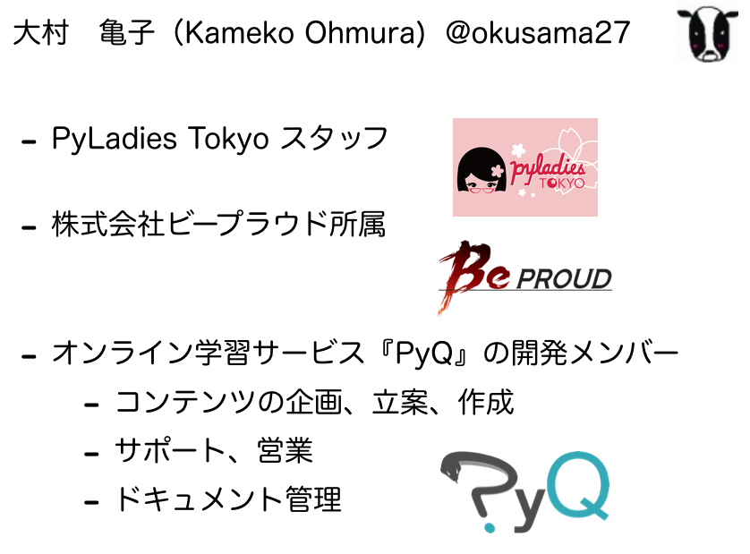

============================================================================================
PyLadies Tokyo Meetup #40 Python入学式
============================================================================================

| 2019.04.13 Kameko Ohmura

自己紹介
============================

今日の資料
==================
本日は、いろいろあって、去年の `こんの🦕manping(@cz3325)さん <https://twitter.com/cz3325>`_ さんのスライドを使わせていただきます。

https://www.slideshare.net/ManPingHe/hands-on-python-20180422-pyladies-tokyo-meetup-31-python

今日の演習
================
Python 3.7.0を使います。もっと古くても大丈夫。でも、Python2だと動かないかも。。

.. important:: バージョン確認しましょう。ターミナルでコマンド打ってみて。

   $ python -V

.. important:: macOSの人は3をつけてみよう。

   $ python3 -V

入ってない人は、インストールしよう。
https://www.python.org/

Python3.7.3 (2019-04-12現在）

エディタ
============
いろいろありますが、メモ帳などでも可能です。

今日は大体、ターミナルを使います。

Windowsの場合は、コマンドプロンプト。

`2. Python インタプリタを使う — Python 3.7.3 ドキュメント <https://docs.python.org/ja/3/tutorial/interpreter.html>`_ 

テキストエディタ
==================
macOSの最初から入っているテキストエディタは、リッチテキストという形式なので、「環境設定」⇢「標準テキスト」で形式を変えておこう。

windowsはノートパッド使うといいと思う。

