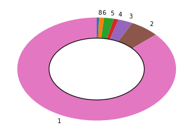

===========================================================================================================
周りのPyCon JPでtalk当選したことがある人に応募のコツを聞いて、考察（あくまで個人の見解）
===========================================================================================================

| Kamekokamekame

周りのPyCon JPでtalk当選したことがある人に応募のコツを聞いて、考察した話
===========================================================================================================

2017-10-15 PyLadies Tokyo - 3周年記念パーティ
===========================================================================================================

あくまで個人の見解です。
===========================================================================================================

PyLadies Tokyo 3周年おめでとうございます！！
====================================================================================

自己紹介：『かめちゃん』です。
==========================================

はじめに
==============

PyCon JP 行ったことありますか？
----------------------------------------------

PyCon JP 楽しいですね。
----------------------------------------------

トーク
============================

ところで、

PyCon JPのtalkに応募したことはありますか？
----------------------------------------------

私はあります。２回ですけど。

結果はまぁ、『落選』
----------------------------------------------

(´；ω；\`)

調査（PyCon JP mini 〜 2017）
========================================================

PyCon JPのページを雑にスクレイピングしました。（トーク限定）

トーク発表者（基調講演とか、グループとかのぞく。個人でトークした人のみ）

だいたい200人
--------------------

3回以上登壇した人

たぶん15人
--------------------

5回以上

たぶん7人
----------------------

図にしてみると
========================================================

結構、狭き門
========================================================

落ちた通った、どうやったら通るのか？
----------------------------------------------------------------

と純粋な応募者の立場でこのネタを話すが好きなので、敢えて選考をしているような方には何も聞かないようにしています。

今後も私に教えないで下さい。
----------------------------------------------------------------

聞き込み
==============

5回以上発表している人（複数）が近くにいたので聞いてみました。
------------------------------------------------------------------------------------

ここからは聞いた話と私の考察が混じっています。

あくまで私、個人の見解です。

応募するときに書く内容（2017年）
====================================

- タイトル
- カテゴリ
- 説明
- 対象者
- Pythonレベル
- 目的
- 要約
- アウトライン
- その他メモ

まずは自己アピール
====================================
- 自己紹介

  - 自分誰か
  - なにをしている人なのか

- 熱意

  - 自分の発表がどれだけ皆の役に立つか
  - このためにやってきたこと

- 実績

  - Pythonエンジニアとしての実績
  - 他の会での発表の経験
  - 本の出版
  - コミュニティーへの貢献
  - OSSへの貢献

師匠のアドバイス
=======================================

- 誰もお前のことを知らない。
- 自己紹介を熱く語れ。
- 『その他メモ』に熱意を詰めろ！

テーマ選び
==============

- 新規追加された機能を探す
- プログラマが混乱しやすい機能（同じような機能だけど、複数ある）
- 他の言語で流行っている本、話題をPythonに置き換えて考える
- 毎年、同じテーマを出し続ける（徐々に聞きたいファンが増えてくる）
- まだ誰も手を付けていないこれから流行りそうなテーマを探す

師匠のアドバイス
=======================================

- たくさん考えて、たくさん出す

運
==============
- トラックが多い場合は、「はじめてのXXをしてみました」などの初心者向けの内容も通る

師匠のアドバイス
=======================================

- トラックが多そうな場合は初心者向け内容をたくさん出すのも良さそう

投稿時の準備
============================

- 選んでいる人がその分野に詳しいかわからないので、選考者にしか見えない部分に発表の詳細を書く
- 詳細なアジェンダ、スライドを途中まで作って出す

師匠のアドバイス
=======================================
- タイトルだけでも通るときは通る

内容
============================
- 皆が聞きたいと思う内容
- 皆が聞きたいと思うレベル感

師匠のアドバイス
=======================================
- 通ってから他の発表者の内容もみて、全力で考える

最後に
==============

運良く通っても

「あの発表ハズレだったね。」
-----------------------------------------------------------------------------------------------------------------------

と言われては末代までの恥なので、

発表できる日を夢見て精進していきます！！！
-----------------------------------------------------------------------------------------------------------------------

終わり
==============