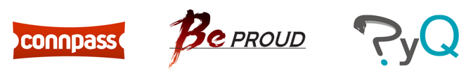
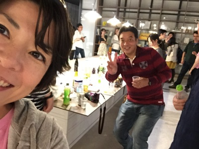
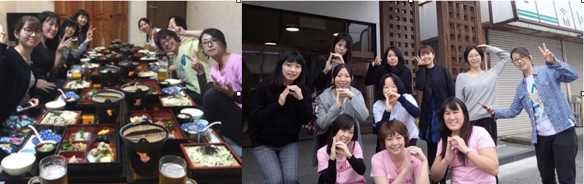
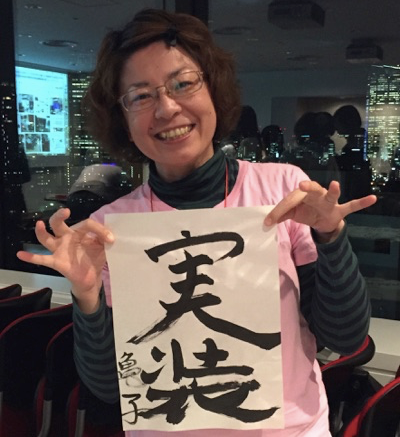
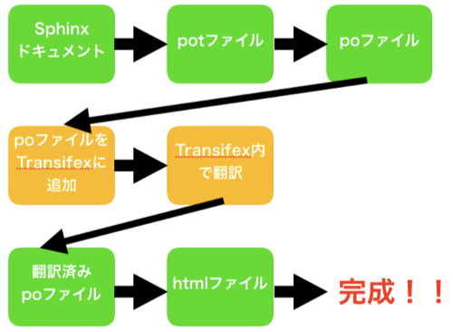
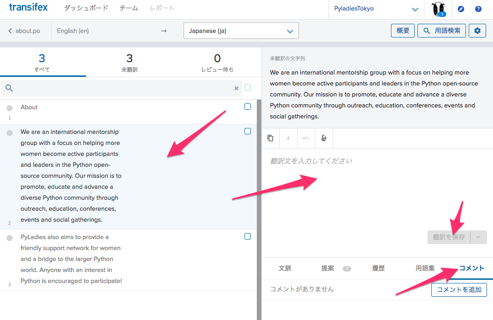

===========================================================================
PyLadies ハンドブックをSphinxとTransifexで翻訳した話
===========================================================================

| Kameko Ohmura
| https://github.com/okusama27

お前誰よ
============================

大村亀子（ `@okusama27 <https://twitter.com/okusama27>`_ ）

牛のマークで活動, Python歴3年, 最近、筋トレにハマっています。

.. image:: _static/images/cow.png
   :width: 80px

PyLadies Tokyo のスタッフを今年の4月からやっています。

.. image:: _static/images/pyladies_logo.png
   :width: 120px

BeProudという会社で、Pythonオンライン学習サービス『PyQ』の開発をしています。

PyLadies Tokyo 3周年パーティー以降のこと
==============================================

2017年10月
==============================================
PyLadies Tokyo - 3周年記念パーティ
----------------------------------------------------------------
去年のパーティーも楽しかったですね！

この頃は普通の参加者でした。イベントやコミュティーのTシャツ集めるの好きなだけで「シャツ着ているけどスタッフじゃありません。」が、持ちネタでした。

2017年11月
==============================================
PyLaides Tokyo 合宿 in 秩父
----------------------------------------------
初の合宿参加。とても楽しかったです。

2017年11月
==============================================

PyLadies Handbook 翻訳しNight 〜第2夜〜
----------------------------------------------
PyLadiesにあまり貢献できることがないと思っていたのですが、翻訳ならできそう！と思いました。

2018年1月
==============================================
スタッフになりました！！
---------------------------

**「スタッフになりたーい！」** と言うとなれます！興味がある方は声かけてください！！

土日の参加は厳しいときもありますが、 **翻訳しNight!** があまり進んでいなかったようなので、主導するためにスタッフになりました。

2018年2月
==============================================
PyLadies Tokyo Meetup #29 テストをまなぼう
---------------------------------------------------------
講師に初挑戦しました。PyLaidesには **講師も女性** という鉄の掟があります。

メンバーの方、外部の方も積極的に講師をやっていただけると嬉しいです。

普段は講師なんて！って思っている方も講師というより **自分が勉強したことをわかりやすく人に説明する** という気持ちで挑むと心が安らかになります。

2018年3月〜9月
==============================================
他にもたくさんのイベントに参加できました。家族とみんなに感謝！

- PyLadies Tokyo Meetup #30 PythonでIoT!
- PyLadies Tokyo Meetup #31 Python入学式
- PyLadies Handbook 翻訳しNight 〜第3夜〜
- PyLadies Tokyo Meetup #34 PyLadies × XR女子部交流会
- PyLadies Handbook 翻訳しNight 〜第4夜〜
- PyLadies Tokyo Meetup #35 もくもく会
- PyLadies Handbook 翻訳しNight 〜第5夜〜

2018年10月
==============================================
PyCon JP 2018のコミュティーポスター
---------------------------------------------------------
沢山の人と出会えました。ありがとうございます！

.. image:: _static/images/image04.png\
   :height: 500px

Sphinxからpoファイル作ってTransifexで翻訳してから、Sphinxに戻した話
===========================================================================
pyladies-kit
=======================
PyLadies 本部に、どの地域でもPyLadiesを始められるように `pyladies-kit <https://github.com/pyladies/pyladies-kit>`_ が用意されています。

.. code-block:: bash
   :linenos:

   $ pip install pyladies
   $ pyladies handbook

これを **翻訳して、本家に取り込んでもらおう!** という目標のもと始まりました。

まず、第１段階として **行動規範** と、 **ハラスメントを受けた場合の対処法** の部分をPyCon JP 2018までに翻訳する事になりました。

Sphinxが便利すぎる
===========================================================================
本家のハンドブックがSphinxプロジェクトなので、簡単に翻訳できます。

poファイルって見にくい
===========================================================================

生のpoファイル
::

   # 283ad006df7242c59abb816f7d85b03f
   #: ../../about.rst:4
   msgid "About"
   msgstr ""  ←ここに翻訳を書く

   # 55b61f6216ec4b70a10a738011d5cc82
   #: ../../about.rst:6
   msgid ""
   "We are an international mentorship group with a focus on helping more "
   "women become active participants and leaders in the Python open-source "
   "community. Our mission is to promote, educate and advance a diverse "
   "Python community through outreach, education, conferences, events and "
   "social gatherings."
   msgstr ""  ←ここに翻訳を書く

   # 3eeae7895cb74421a96d163b715a0835
   #: ../../about.rst:8
   msgid ""
   "PyLadies also aims to provide a friendly support network for women and a "
   "bridge to the larger Python world. Anyone with an interest in Python is "
   "encouraged to participate!"
   msgstr ""  ←ここに翻訳を書く

Transifexが便利すぎる
===========================================================================

目標達成
===========================================================================

目標の **行動規範** と、 **ハラスメントを受けた場合の対処法** の部分の翻訳は終了しました。

.. image:: _static/images/image07.png
   :height: 450px

https://pyladiestokyo.github.io/coc/index.html

みんなありがとう！！
===========================================================================

延べ約30人の翻訳者の方！
---------------------------------------------------------

使い方を教えてくださったSphinxコミュティーの方！
-----------------------------------------------------------------------------

これからもハンドブックの翻訳は続けていきますので、興味がある方は Slackの **#handbook-translation** まで！

また、ハラスメントを受けた方は、スタッフにダイレクトメッセージを送るか、Slackの **#pyladies-support** まで！

あと、 **2018年11月28日** に **SphinxCon JP 2018** が開催されます。connpassで募集してました。私も行くので、一緒に行きましょう！！

これからもPyLadies Tokyoをよろしくおねがいします！
===========================================================================

いつでも参加をおまちしています。

スタッフ募集中です。

講師（女性）も募集中です。こんなことなら、話せるかも！などありましたらスタッフに声をかけてください！

.. image:: _static/images/pyladies_logo.png
   :width: 400px