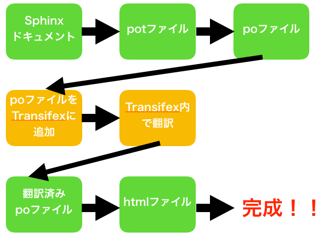
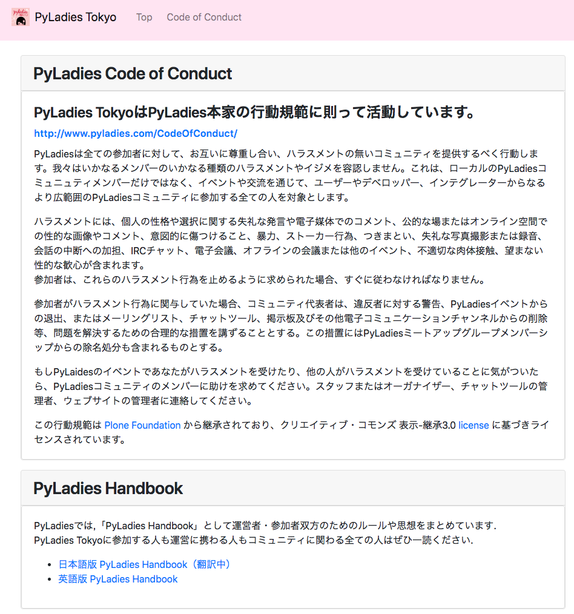

============================================================================================
Sphinxからpoファイル作ってTransifexで翻訳してから、Sphinxに戻した話
============================================================================================

| Kameko Ohmura
| https://github.com/okusama27

アジェンダ
===============
- 自己紹介
- PyLadies Tokyoの紹介
- 翻訳しNightの紹介
- Sphinxからpoファイル作ってTransifexで翻訳してから、Sphinxに戻した話
- 私とSphinx
- PyQの紹介

.. include:: whoami.rst

.. include:: pyladies.rst

Sphinxからpoファイル作ってTransifexで翻訳してから、Sphinxに戻した話
===========================================================================
pyladies-kit
=======================
PyLadies 本部に、どの地域でもPyLadiesを始められるように `pyladies-kit <https://github.com/pyladies/pyladies-kit>`_ が用意されています。

.. code-block:: bash
   :linenos:

   $ pip install pyladies
   $ pyladies handbook

これを **翻訳して、本家に取り込んでもらおう!** という目標のもと始まりました。

まず、第１段階として **行動規範** と、 **ハラスメントを受けた場合の対処法** の部分をPyCon JP 2018までに翻訳する事になりました。

Sphinxが便利すぎる
===========================================================================
本家のハンドブックがSphinxプロジェクトなので、簡単に翻訳できます。

poファイルって見にくい
===========================================================================

生のpoファイル
::

   # 283ad006df7242c59abb816f7d85b03f
   #: ../../about.rst:4
   msgid "About"
   msgstr ""  ←ここに翻訳を書く

   # 55b61f6216ec4b70a10a738011d5cc82
   #: ../../about.rst:6
   msgid ""
   "We are an international mentorship group with a focus on helping more "
   "women become active participants and leaders in the Python open-source "
   "community. Our mission is to promote, educate and advance a diverse "
   "Python community through outreach, education, conferences, events and "
   "social gatherings."
   msgstr ""  ←ここに翻訳を書く

   # 3eeae7895cb74421a96d163b715a0835
   #: ../../about.rst:8
   msgid ""
   "PyLadies also aims to provide a friendly support network for women and a "
   "bridge to the larger Python world. Anyone with an interest in Python is "
   "encouraged to participate!"
   msgstr ""  ←ここに翻訳を書く

Transifexが便利すぎる
===========================================================================

.. image:: _static/images/image06.png

目標達成
===========================================================================

目標の **行動規範** と、 **ハラスメントを受けた場合の対処法** の部分の翻訳は終了しました。

https://pyladiestokyo.github.io/coc/index.html

みんなありがとう！！
===========================================================================

延べ約30人の翻訳者の方！
---------------------------------------------------------

使い方を教えてくださったSphinxコミュティーの方！
-----------------------------------------------------------------------------

これからもハンドブックの翻訳は続けていきますので、興味がある方は Slackの **#handbook-translation** まで！

また、ハラスメントを受けた方は、スタッフにダイレクトメッセージを送るか、Slackの **#pyladies-support** まで！

あと、 **2018年11月28日** に **SphinxCon JP 2018** が開催されます。connpassで募集してました。私も行くので、一緒に行きましょう！！

これからもPyLadies Tokyoをよろしくおねがいします！
===========================================================================

いつでも参加をおまちしています。

スタッフ募集中です。

講師（女性）も募集中です。こんなことなら、話せるかも！などありましたらスタッフに声をかけてください！

.. image:: _static/images/pyladies_logo.png
   :width: 400px