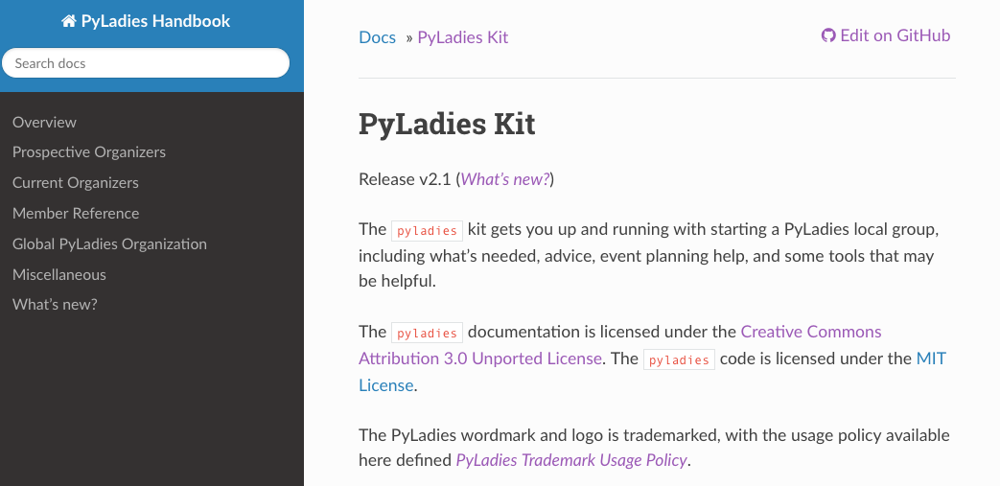
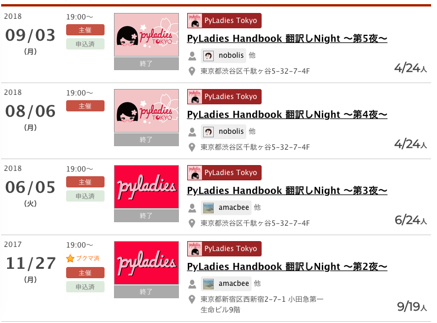
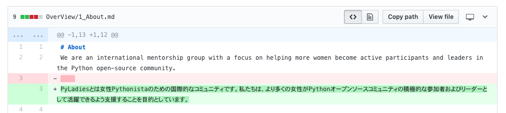
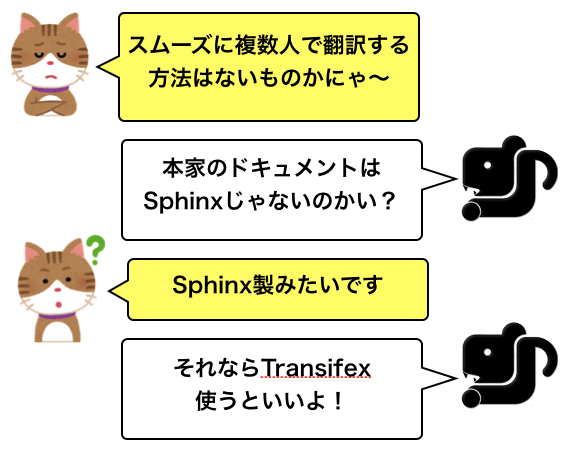
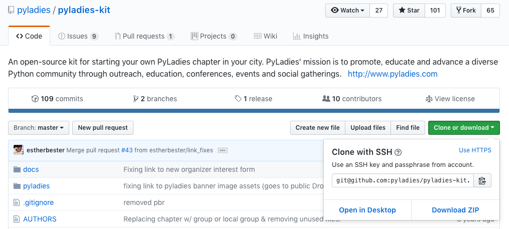
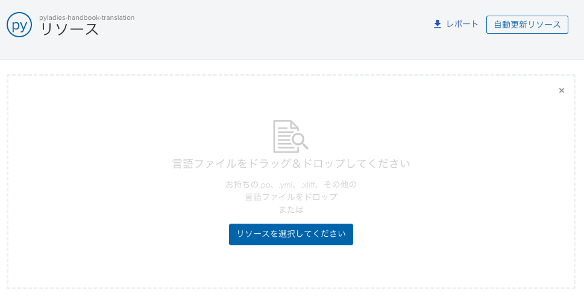
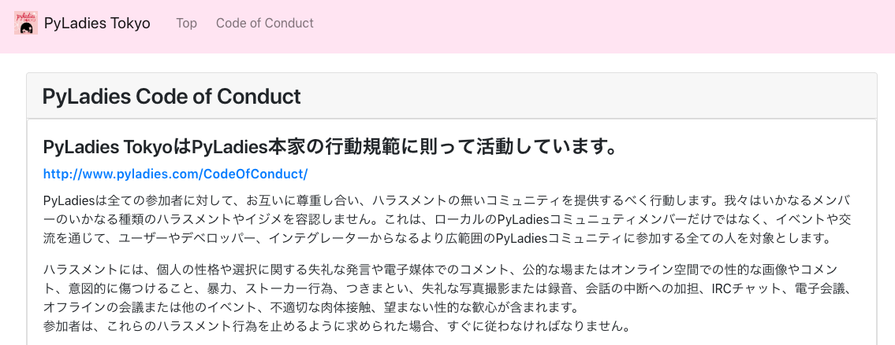
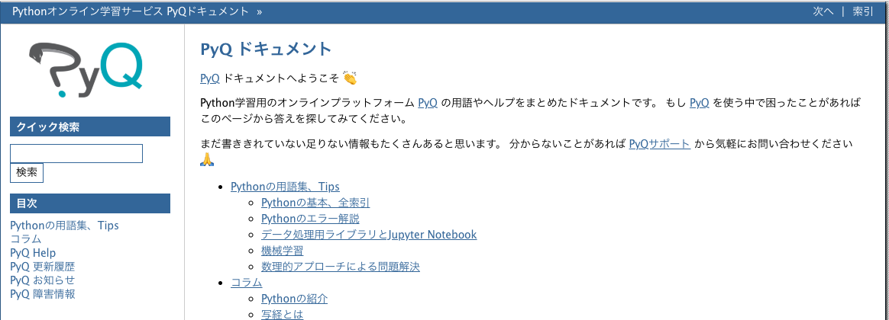
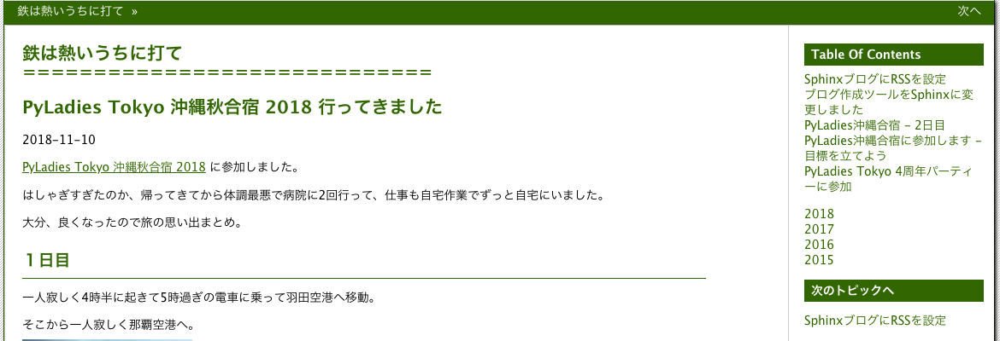

============================================================================================
Sphinx製ドキュメントの日本語化
============================================================================================

| Sphinxからpoファイル作ってTransifexで翻訳してから、Sphinxに戻した話

| Kameko Ohmura

今日話すこと
===============

＊　自己紹介
-----------------------

＊　PyLadies Tokyo
-----------------------

＊　翻訳した話
-----------------------

＊　おまけ
-----------------------

自己紹介
============================

.. image:: _static/images/whoami.png
   :align: left

PyLadies Tokyo とは
===========================================

PyLadiesは，Pythonが好きな女性を結ぶ国際的なコミュニティです。

Pythonが好きであれば初心者／熟練者問わずどなたでも参加できます。

PyLadies Tokyoは,PyLadiesの東京支部として女性Pythonistaを繋ぐために活動しています。

.. image:: _static/images/pyladies_logo.png

参加者募集中！
------------------

詳しくは、https://pyladiestokyo.github.io/ を御覧ください。

PyLadies Handbook
=======================================

本家PyLadiesにPyLadiesのハンドブック `PyLadies Handbook <http://kit.pyladies.com/>`_ があります。

書いてあること
=======================================

- ローカルPyLadiesの作り方
- PyLadiesの運営方法
- 誰が参加できるかなど
- PyLadiesの行動規範
- ロゴなどの権利

pip
---------

pipでインストールできます。

.. code-block:: bash
   :linenos:

   $ pip install pyladies
   $ pyladies handbook

翻訳プロジェクト発足
=======================================

特に本家のページはもちろん英語ですが、メンバーやこれから参加を考えている人にも読んでほしいと思い、翻訳を開始しました。
最終的には **翻訳して、本家に取り込んでもらう** のが目標です。

まず、第１段階として **行動規範** と、 **ハラスメントを受けた場合の対処法** の部分をPyCon JP 2018までに翻訳しました。

翻訳しNight!
==================

翻訳しNightというイベントを開いてみんなで翻訳することにしました。

最初のやり方
===================
- GitHubにリポジトリを作る
- 本家の英文をコピー（本家、rstなのにmdにコピー）
- issueで範囲、担当を指定
- 英文の真下に1行ずつ日本語を書いて、担当ページが終わったらPRを作る
- PR上でレビューと修正を行う

問題点
==========================

戻す時どうするの？
-----------------------

レビューがやりづらい
-----------------------

GitHub使えない人が参加しにくい
-----------------------------------

相談
============
メンバーの一人がSphinx ユーザーグループに相談しました。

あまり翻訳が進んでなかったのであっさりTransifexを使うことに決定！！

翻訳機能
===============
Sphinxを使うとドキュメントの多言語化が容易にできます。

``po`` ファイルを作って、訳文を書くと言語によって入れ替えて表示してくれます。

生poファイル見づらい問題
--------------------------------

::

   # 283ad006df7242c59abb816f7d85b03f
   #: ../../about.rst:4
   msgid "About"
   msgstr ""  ←ここに翻訳を書く

   # 55b61f6216ec4b70a10a738011d5cc82
   #: ../../about.rst:6
   msgid ""
   "We are an international mentorship group with a focus on helping more "
   "women become active participants and leaders in the Python open-source "
   "community. Our mission is to promote, educate and advance a diverse "
   "Python community through outreach, education, conferences, events and "
   "social gatherings."
   msgstr ""  ←ここに翻訳を書く

Transifexで翻訳
=======================================

本家のGitHubからpyladies-kitを取得（clone）
=======================================================

準備
=======================================================

Sphinxをインストール
--------------------------------

::

   $ pip install Sphinx
   $ pip install sphinx-intl

docs/ に移動
--------------------------------

conf.pyのファイルの最後に追加
--------------------------------

::

   locale_dirs = ["locale"]
   language = "ja"

potファイルを作成するコマンドを実行
----------------------------------------------------------------

::

   $ make gettext

``_build/locale`` の下に ``*.pot`` ファイルができている

potファイルからpoファイルを作る
----------------------------------------------------------------

::

   $ sphinx-intl update -p _build/locale -l de -l ja

Tansifex
==================

プロジェクトを作成
---------------------------

poファイルを追加
-------------------------

翻訳する
=============================================================

左側の英文を選んで、翻訳を右側に書くだけ。レビューも同じ画面でできる。コメントも付けられる。

.. image:: _static/images/pyladies_transifex_3.png
   :width: 650px

詳しくは、 `翻訳とレビュー <https://github.com/PyLadiesTokyo/pyladies-handbook-translation/blob/master/how_to/how_to_translate.md>`_ で解説

翻訳後のファイルを日本語版ドキュメントファイルに戻す
=============================================================

locale/ja/LC_MESSAGES/ に翻訳したpoファイルを戻す
-----------------------------------------------------------------

htmlファイルを作成する
-------------------------------------------

::

   $ make -e html

完成
================

目標の **行動規範** と、 **ハラスメントを受けた場合の対処法** の部分の翻訳は終了しました。

https://pyladiestokyo.github.io/coc/index.html

おまけ
===================

私とSphinx
========================

**Sphinx歴3年半＝会社歴**

会社のドキュメント類（Redmineなど）が ``reStructuredText`` を利用していたので初めて使いました。

それまでは、 ``Markdown`` を使っていました。

- 2015: ビープラウド入社。reStructuredTextに出会う。
- 2016: ブログをSphinxに移行。ただし、Markdownで表記
- 2017: PyQリリース。ドキュメントをSphinxで作成
- 2018: ブログをSphinxに移行（2回目） ``reStructuredText`` のみで記述

docs.pyq.jp
====================

| 　

鉄は熱いうちに打て
====================

| 　

| 　

フォーマットなどはこれからがんばります。
